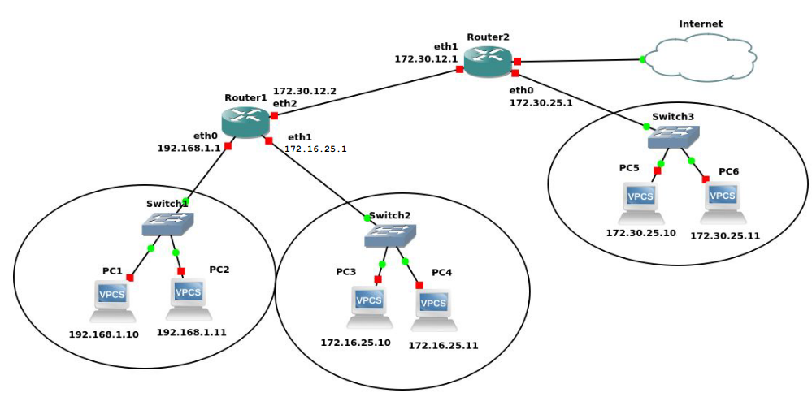

## Encaminamiento

- Los routers operan de manera similar a los conmutadores, ya que también
filtran el tráfico de la red
- En lugar de hacerlo según las direcciones físicas (MAC) lo hacen en base a
las direcciones lógicas (direcciones IP)
- La función de encaminamiento se realiza en la capa de Red del modelo OSI
- Utilizan una tabla de encaminamiento y una o varias métricas de red
- Las tablas de encaminamiento pueden configurarse:
	- **Estáticas** → programadas por el administrador de red
	- **Dinámicas** → mediante un protocolo de enrutamiento
	- **Híbridas** → son dinámicas pero el administrador puede añadir alguna
entrada de forma manual

Supongamos que tenemos este esquema de red

El PC1 tendría la siguiente tabla de encaminamiento

| **Equipo** | **Destino** | **Máscara**   | **Gateway** | **Interfaz** |
|:----------:|:-----------:|:-------------:|:-----------:|:------------:|
|  **PC1**   |  127.0.0.1  |   255.0.0.0   |      *      |      lo      |
|            | 192.168.1.0 | 255.255.255.0 |      *      |     eth1     |
|            |      *      |       *       | 192.168.1.1 |     eth1     |

El Router1 tendría la seiguiente tabla de encaminamiento

| **Equipo** | **Destino** | **Máscara**   | **Gateway** | **Interfaz** |
|:----------:|:-----------:|:-------------:|:-----------:|:------------:|
|**Router1** | 192.168.1.0 | 255.255.255.0 |      *      |     eth0     |
|            | 172.16.25.0 | 255.255.255.0 |      *      |     eth1     |
|            | 172.30.25.0 | 255.255.255.0 | 172.30.12.1 |     eth2     |
|            |      \*     |      \*       | 172.30.12.1 |     eth2     |

